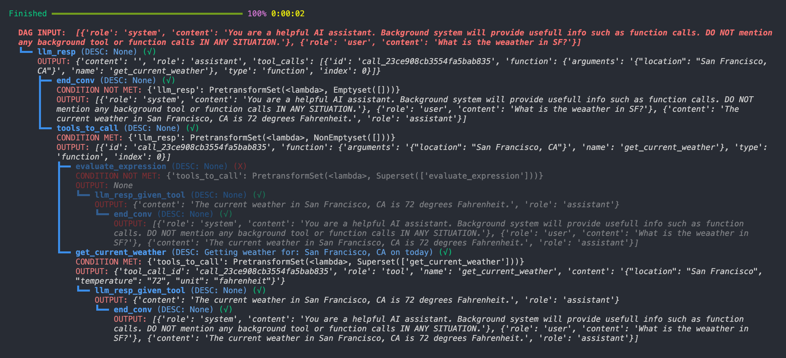

# LangDAG



## Introduction

> Work in process. LangDAG is still experimental.

**LangDAG** is a specialized orchestration framework for building LLM (Large Language Model) agent workflows using DAGs([Directed Acyclic Graphs](https://en.wikipedia.org/wiki/Directed_acyclic_graph)), written in Python. 

DAGs, widely used in data orchestration tools like Airflow, can be effectively applied to build LLM agent workflows. Despite their simplicity, DAGs are both expressive and powerful.

**LangDAG** demonstrates how DAGs can be utilized to build LLM agents. It provides several advantages:

- **Package Agnostic:** Plain functions first and not tied to any other specific LLM tool framework or package.
- **Friendly Syntax:** Features an intuitive DAG syntax that minimizes unnecessary complexity.
- **Stateful:** Allows a shared DAG state among steps or nodes in a DAG.
- **Concurrent Execution:** Identifies steps that can run concurrently and enables concurrent execution without requiring manual concurrent logic.
- **Conditional Routing:** Allows using conditional edges to route queries or outputs to subsequent steps.
- **Hooks:** Provides customizable hook functions for executing additional tasks (ie., logging, state reporting) before and after node execution.
- **Observability:** Offers a tree-structure diagram (Execution Visualization) for inspecting the DAG execution process directly in your console, making state, output, condition tracking easier.
- **Uniform Achitechture:** Ensures a consistent unit structure for all steps (nodes).
- **Reusabe Unit:** Enables nodes to be reused across different workflows.

## Motivation

Creating workflows for constructing LLM agents can be manageable when there are only a few steps. However, as the complexity of the workflow increases, several challenges arise:

- **Navigation and Modification:** Finding or modifying specific elements requires navigating through numerous `if` and `for` statements.
- **Logging:** Manually logging the intermediate states of variables and tracking which conditions are met becomes cumbersome.
- **Execution Path:** Determining the execution path and understanding how an input query triggered the relevant processes can be difficult.
- **Reusability:** Reusing parts of the workflow often involves copying, pasting, and modifying code snippets from old repositories.
- **Hook Functions and Callbacks:** Adding hook functions or triggering callback functions in any step necessitates finding and modifying specific code sections.
- **Concurrent Execution:** Implementing multithreading manually for concurrent execution of steps is time-consuming.
- **Flexibility:** Being stuck in inflexible frameworks limits your ability to adapt and extend your workflows.

LangDAG aims to addresses these challenges, providing a solution for constructing and managing complex LLM agent workflows.

## 📑 Contents

1. **[💬 Concepts](#-Concepts)**

2. **[🔧 Setup](#-setup)**

3. **[💻 Usage](#-usage)**

4. **[📕 API Reference](#-api-reference)**

## 💬 Concepts

Before you start, it’s helpful to learn some concepts.

### Node

A node, also referred to as a *vertex*, is a fundamental unit in a DAG. In **LangDAG**, a node is instantiated with a unique `node_id` (required) and an optional `prompt`.

The `prompt` serves as a fixed input in the context of LLMs, acting as predefined input for the node.

A node can have a predefined `prompt` and also receive outputs from upstream nodes (a dict with upstream `node_id`s as keys and respetive output as outputs, can be a empty dict `{}` if unavailable). It treats both the prompt and the upstream outputs as inputs, processes them, and produces an output that is passed to downstream nodes.

An LLM node treats the upstream output as external input and its own prompt as an internal predefined input. It uses a `transforming function` (the `func_transform` parameter of the `Node` class) to convert these inputs and generate the output.


### Edge

An edge represents a connection between nodes, directed from an upstream node to a downstream node. A node can have multiple upstream and downstream nodes. It’s crucial to avoid creating cycles, as they can lead to infinite loops, which are generally undesirable and forbbiden in a DAG. As a side note, you can still (and it is common) to use loops outside a DAG.

In the context of LLM agents, specific tasks often require multiple steps execute sequentially.

For example, in an LLM DAG, an upstream `Node_A` can point to a downstream `Node_B` with a directed edge `A >> B` (**LangDAG** uses `>>` as notation for a directed edge). This means `Node_A` executes first, and its output is passed along the edge `A >> B` to `Node_B`. The output of `Node_A` is typically referred to as the **upstream output**. `Node_B` can then use this upstream output in its execution. 

Please note that upstream output in LangDAG refers to the outputs of the upstream nodes that have explicit connections to the node. For example, In `A >> B >> C`, the output of A will not be accessible to node C unless we explicit add another `A >> C`. 

`Node_A` can also be called a *parent node* or the *dependent of B*.

`Node_B` can have multiple upstream nodes, such as `Node_A1`, `Node_A2`, etc. By default, `Node_B` will execute only after all upstream nodes have finished (later we will see how to change this default behavior). 

Conversely, `Node_B` can also have multiple downstream nodes.

### Conditional Edge

We just talked about simple edges, but LangDAG allows you to use *conditional edges*, which means you can decide whether or not to execute a downstream node based on if the outputs form upstream nodes met certent condition. 

As a pseudo example, 

```python
A >> 1 >> B
```

create a *conditional edge*, which means if A outputs 1, B will execute.


### Input and Output of a Node

As mentioned, nodes are connected by directed edges. They receive upstream outputs as external inputs and then generate outputs for downstream nodes.

The format of the upstream output for `Node_B` with two upstream nodes `node_A1` and `node_A2` is:

```python
{node_A1: Any, node_A2: Any, ...}
```

Here, `node_A1` and `node_A2` are the `node_id`s of upstream nodes, and `Any` represents any type of Python object.

These keys identify the source of the output from different upstream nodes.

For a node with a single upstream node, the upstream output format is:

```python
{node_A1: Any}
```

The output format of a node, say `Node_B`, is:

```python
{node_B: Any}
```

where `node_B` is the `node_id` of the current node.


### DAG (Directed Acyclic Graphs)

In **LangDAG**, a DAG is simply a huge or small workflow graph with nodes, connected with edges.

**LangDAG** orchestrates all nodes (steps in a workflow) in such graph structure.


### DAG State (or `dag_state`)

As mentions, nodes process information from upstream and pass their current output to downstream nodes. Unless we explicitly set upstream or further upstream information in the current node’s output (which can be verbose and unnecessary), a node cannot access information created by nodes not directly connected to it.

In **LangDAG** , we use a **DAG State** (`dag_state`), which is a info dict shared by all nodes in a DAG. 

`dag_state` is initialized as 

```python
{
    "input": dag_input,
    "specs": {},
    "output": None
}
```
where `dag_input` is `None` if not specified when a DAG is created, `specs` is use to save all the specs of nodes, `output` is to set the output of the DAG. These keys are reserved, please do not override them in most cases.

Aside from the reserved keys, you can set anything to **DAG State** in the node's transformation, and subsequent nodes can access this **DAG State** during data transformation via the `dag_state` parameter in `func_transform`.

Please note that, a **DAG State** is defined on a `LangDAG` instance and is accessible to nodes within that DAG during execution.

### Execution Behavior

In real scenarios, there can be multiple edges from upstream to a node, among which some are unconditional edges and others are conditional edges. We need a way to figure how to control the execution of nodes in a DAG.

Let us first have a look at node execution states (`node.execution_state`) as well as an important LangDAG concept *"acceptable"*.

A node can have 3 state: initialized, finished, aborted.

1. A node is *initialized* when it is create, added to a DAG yet to run.

2. A node is *finished* if it is allowed to run and finished running.
- Starting nodes in a DAG is always allowed to run.
- For a node, an upstream node is *"acceptable"* if it is *finished* and condition met(if condition edge exist).
- For a node, an upstream node is not *"acceptable"* if it is *not finished* or it is *finished* but condition not met.
- By default behavoir, a node will execute and finished if all upstream nodes are *"acceptable"*, otherwise it will not be finished.
- Default behavoir can be changed to: a node will execute and finished if **any** upstream nodes are *"acceptable"*, otherwise it will not be finished.

3. If no exceptions occured, A node is either *finished* or *aborted*. (You will need to handle exceptions yourself.)


### Putting It All Together

To summarize:
- A `node` is a step for transforming data.
- A DAG organizes these steps.
- To create a DAG, we create nodes and connect them with (conditional) edges.
- Nodes can process information and pass it to downstream nodes, enabling step-by-step data processing.
- Shared information can be saved to **DAG State** , accessible to any subsequent nodes.
- Execution behavior is up to whether all/any upstream nodes are *"acceptable"*.


## 🔧 Setup

### Installation

Install LangDAG using pip:

```sh
$ pip install langdag
```

From Python 3.12, you will need to create & activate a virtual environment before using the command.

### Import

Then import it:

```python
from langdag import Node
```

To save some time, though not necessary, you may import all of these before try out the examples.

```python
from langdag import Node, LangDAG, run_dag
from langdag.processor import MultiThreadProcessor, SequentialProcessor
from langdag.selector import MaxSelector
from langdag.executor import LangExecutor
from langdag.utils import default, Emptyset, NonEmptyset, Superset, Subset
from langdag.decorator import make_node
```

## 💻 Usage

### Defining Nodes

To create a node in LangDAG, use the `Node` class. Here’s an example:

```python
node_1 = Node(
    node_id="node_1",
    prompt="SOME PROMPT...",
    func_transform=lambda prompt, upstream_output, dag_state: ...(YOUR LOGIC HERE),
)
```

**Main Parameters**:

- **node_id**: *(required)*, a unique identifier for each node instance.

- **prompt**: *(optional, defaults to `None`)*, a predefined prompt for the node.

- **func_transform**: *(optional)*, a function that takes `prompt`, `upstream_output`, and `dag_state` as inputs and generates the output of the current node. If not defined, the output will be `None`. You can use a Python `lambda function` for simplicity or a regular function for more flexibility. Please note that upstream output in LangDAG refers to the outputs of the upstream nodes that have explicit connections to the node. For example, In `NodeA >> NodeB >> NodeC`, the output of NodeA will not be accessible to NodeC unless we explicit add another `NodeA >> NodeC`. 


Here’s an example node_2 is generating an answer based on city name extracted by node_1 from the use query.

```python
node_2 = Node(
    node_id="node_2",
    prompt="The weather in #CITY is #WEATHER.",
    func_transform=lambda prompt, upstream_output, dag_state: 
        prompt.replace('#CITY', upstream_output['node_1'])
              .replace('#WEATHER', get_weather(upstream_output['node_1'])),
)
```

In this case, the output might be `The weather in NY is sunny.`.


**Execution Order**: When a node executes, `func_transform` runs first

After execution, the node output can be accessed using `node.node_output`.

Additionally, when making function / tool calling agents, you may want to add `spec` to the node by 
setting node.spec attribute or use `node.add_spec()` method after creating a node. For example,

```python
node_2 = Node(
    node_id="node_2",
    prompt="The weather in #CITY is #WEATHER.",
    spec = {dummyNestDict...}
    func_transform=lambda prompt, upstream_output, dag_state: 
        prompt.replace('#CITY', upstream_output['node_1'])
              .replace('#WEATHER', get_weather(upstream_output['node_1'])),
)
```

or 

```python
node_2 = Node(
    node_id="node_2",
    prompt="The weather in #CITY is #WEATHER.",
    func_transform=lambda prompt, upstream_output, dag_state: 
        prompt.replace('#CITY', upstream_output['node_1'])
              .replace('#WEATHER', get_weather(upstream_output['node_1'])),
)

node.add_spec({dummyNestDict...})
```

After adding a spec to a `node`, you can acess the spec with `node.spec`, or you can alse get a list of specs of all nodes (if spec available) in a DAG (will be explained later) `dag` by `dag.get_all_specs()`.


### Define Nodes with Decorators

> `@make_node()`

You can use the `@make_node()` decorator above a transforming function (ie `func_transform`) to create a node from that function. This method is useful for creating nodes where the `node_id` is the function (ie `func_transform`) name, and when the function is hard to defined with a simple lambda function.

For example, the following two methods of creating nodes are equivalent:

```python
node_2 = Node(
    node_id="node_2",
    prompt = "some_prompt",
    func_transform=lambda prompt, upstream_output, dag_state: 
        prompt.replace('#CITY', upstream_output['node_1'])
              .replace('#WEATHER', get_weather(upstream_output['node_1'])),
)
```

and 

```python
from langdag.decorator import make_node

@make_node(prompt = "some_prompt")
def node_2(prompt, upstream_output, dag_state): 
    res = prompt.replace('#CITY', upstream_output['node_1']).replace('#WEATHER', get_weather(upstream_output['node_1']))
    return res
```

Though the `@make_node()` decorator provide a different way to create a node by directly associating the function with the node's transformation logic, the `@make_node()` decorator has the same functionality as the `Node()` class. It accepts the same parameters as `Node()`, except it uses the decorated function as `func_transform`, and the `node_id` defaults to the name of the decorated function if not explicitly set (the `node_id` parameter can also be manually set to an id that is different from the function name).

> `@@make_node(spec = {...})`

Use spec parameter in `@make_node()` decorator to add function / tool spec to this node.
This is optional, but will be helpful if you are working on function calling or tool calling, and 
want to define function / tool spec on a Node. After adding a spec to a `node`, you can acess the spec with `node.spec`, and you can also get a list of specs of all nodes (if spec available) in a DAG `dag` by `dag.get_all_specs()`.

### Default Upstream Output

If a node has only one upstream node, and you want to access its output directly in `func_transform`, you can use the `default` function from `langdag`.

```python
from langdag.utils import default

node_2 = Node(
    node_id="node_2",
    prompt="The weather in #CITY is #WEATHER.",
    func_transform=lambda prompt, upstream_output, dag_state: 
        prompt.replace('#CITY', default(upstream_output))
              .replace('#WEATHER', get_weather(default(upstream_output))),
)
```

The `default` function accept a dict with a single item, otherwise it raise an error.

To improve reusability of a Node, we encourage using `default` instead of using upstream `node_id`. If there are multiple upstream outputs, use `list(upstream_output.values())` to get them as a whole. 


### Define and Run a DAG (Syntax #1)

A Directed Acyclic Graph (DAG) represents a workflow with multiple steps and paths, unlike simple straight-line step-by-step workflows.

To add nodes to a DAG and connect them, use the following syntax:

```python
from langdag import Node, LangDAG

user_question = "Tell me more about SF."

with LangDAG(dag_input=user_question) as dag:
    dag += node_1
    dag += node_2
    dag += node_3
    dag += node_4
    dag += node_5
    dag += node_6

    node_1 >> node_2
    node_2 >> node_3 >> node_6
    node_2 >> node_4 >> node_6
    node_2 >> node_5 >> node_6
```

or you can 
This code defines a DAG and connects nodes as shown:

```text
╭─────────────────────────────────────────────────────────────────╮
│                                                                 │
│     ┌──────┐    ┌──────┐   ┌────────┐       ┌──────┐            │
│     │node_1│ ──▷│node_2├──▷│ node_3 ├──────▷│node_6│            │
│     └──────┘    └──┬───┘   └────────┘       └───▲──┘            │
│                    │       ┌────────┐           │               │
│                    ├──────▷│ node_4 ├───────────┤               │
│                    │       └────────┘           │               │
│                    │       ┌────────┐           │               │
│                    └──────▶│ node_5 ├───────────┘               │
│                            └────────┘                           │
│                                                                 │
╰─────────────────────────────────────────────────────────────────╯
```

Example use case:

1. **node_1**: Translate user question to English.
2. **node_2**: Extracts a English city name (with LLM).
3. **node_3**: Checks the city's introduction.
4. **node_4**: Gets the city's best places to visit.
5. **node_5**: Checks the city's weather.
6. **node_6**: Combines all the information into a friendly response.

To execute the DAG, use the `run_dag` function:

```python
from langdag import MultiThreadProcessor
user_question = "Tell me more about SF."
with LangDAG(dag_input=user_question) as dag:
    dag += node_1
    dag += node_2
    dag += node_3
    dag += node_4
    dag += node_5
    dag += node_6

    node_1 >> node_2
    node_2 >> node_3 >> node_6
    node_2 >> node_4 >> node_6
    node_2 >> node_5 >> node_6

    run_dag(dag)  # <--- THIS LINE
    # run_dag(dag, processor=MultiThreadProcessor())  # Or run concurrently

    print(dag.dag_stae["output"])
```

**Note**: The `run_dag` function can be used either within or not within the `with LangDAG()` context.

You can also run the DAG concurrently using `MultiThreadProcessor`. The final output will be accessible via `dag.dag_state["output"]`.


### Define and Run a DAG without Context Manager  (Syntax #2)

For the above example, though it is recommended to use `with` context manager and simplified `+=` and `>>` syntax, you can also define the DAG without these.

```python
from langdag import MultiThreadProcessor
user_question = "Tell me more about SF."

dag = LangDAG(dag_input=user_question)
dag.add_node(node_1, node_2, node_3, node_4, node_5, node_6 )
dag.add_edge(node_1, node_2)
dag.add_edge(node_2, node_3)
dag.add_edge(node_2, node_4)
dag.add_edge(node_2, node_5)
dag.add_edge(node_3, node_6)
dag.add_edge(node_4, node_6)
dag.add_edge(node_4, node_6)

run_dag(dag)

print(dag.dag_stae["output"])

```


### DAG Execution Observability

To improve observability and inspect the execution of a DAG, you can use the following method:

```python
dag.inspect_execution()
```

This prints a tree-structure diagram. For example:

```sh
DAG INPUT: hello222
┗━━ node_1, desc1, (√), ## <- means node_execution_state=`finished` 
    OUTPUT: False
    ┣━━ node_3, node_desc_of_node_3, (X), ## <- means node_execution_state=`aborted` 
    ┃   OUTPUT: None, Condition not matched: {'node_1': True} ## output of node_1 is False but condition require True
    ┗━━ node_2, node_desc_of_node_2, (√), 
        OUTPUT: False
        ┗━━ node_3, node_desc_of_node_3, (X), 
            OUTPUT: None, Condition not matched: {'node_2': 1}
```

In this diagram:

- (√) indicates that the node execution state is finished.
- (X) indicates that the node execution state is aborted.
- The output of each node is displayed along with conditions that were met or not met. (conditon explain later)

This visualization helps you understand the execution flow and identify any issues or unmet conditions in your DAG.

### DAG Input or `dag_input`

As demonstrated in the previous example, you can use the dag_input parameter when instantiating a node to define an input for all nodes in the DAG:

```python
with LangDAG(dag_input="SOMETHING") as dag:
    dag += node_1
    ...
```

All nodes can access the DAG input in the func_transform method of the node class by using dag_state["input"].


### Find Starts & terminals in a DAG

To find all the starting and terminating nodes, use

```python
print(dag.all_starts())
print(dag.all_terminals())
```

### Cycles in a Graph

Cycles are not allowed in a DAG as they create infinite loops. For example:

```python
with LangDAG() as dag:
    dag += node_1
    dag += node_2
    dag += node_3_1
    dag += node_3_2
    dag += node_4
    dag += node_5

    node_1 >> node_2
    node_2 >> node_3_1 >> node_4 >> node_1
    node_2 >> node_3_2

    run_dag(dag)
```

This will cause an error:

```python
paradag.error.DAGCycleError: Cycle if add edge from "node_4" to "node_1"
```

### Conditional Edges

LangDAG supports conditional execution with **Conditional Edges**. Let us compare two example to see the difference conditional edges make.

Without **Conditional Edges**:

```python
# without conditional edges
with LangDAG("some_input") as dag:
    dag += node_input_clean
    dag += node_check_if_equation
    dag += node_eval
    dag += node_just_answer

    node_input_clean >> node_check_if_equation
    node_check_if_equation >> node_eval # node_eval need a internal logic to tell `if there is eq` first
    node_check_if_equation >> node_just_answer # node_just_answer need a internal logic to tell `if there is eq` first

    run_dag(dag)
```

With **Conditional Edges**:

```python
# with conditional edges
with LangDAG("some_input") as dag:
    dag += node_input_clean
    dag += node_check_if_equation
    dag += node_eval
    dag += node_just_answer

    node_input_clean >> node_check_if_equation
    node_check_if_equation >> True >> node_eval # node_eval does not need a internal logic to tell `if there is eq` first, if condition not met node_eval will be aborted 
    node_check_if_equation >> False >> node_just_answer # node_just_answer does not need a internal logic to tell `if there is eq` first, if condition not met node_just_answer will be aborted 

    run_dag(dag)
```

**Note**: Conditional edges should be unique between two nodes and should only be used as follows:

```python
node_1 >> [condition] >> node_2
```

**Note**: Conditional edges use == in Python to determine if the condition matches the upstream output. Consequently, the following boolean comparisons, for example, will also match:

```python
True == 1  # returns True
False == 0  # returns True
{1:1} == {True:True} # returns True
```

This 'equal' property is also utilized in special condition defining, as we will see in *"Conditions with Special Classes"* later.


**Note**: Adding conditional edges without context manager (Syntax B), please use `add_conditional_edge`, for example:

```python
 dag.add_conditional_edge(node_1, True, node_2)
```

### Multiple Conditions and Upstream Nodes

As we mentioned in *"Exectuion behavior"*:

- For a node, an upstream node is *"acceptable"* if it is *finished* and condition met(if condition edge exist).
- For a node, an upstream node is not *"acceptable"* if it is *not finished* or it is *finished* but condition not met.

By default, a node will execute and finished if all upstream nodes are *"acceptable"*, otherwise it will not be finished (ie, itwill be aborted).

Consider the following example:

```python
with LangDAG("my input") as dag:
    dag += node_1
    dag += node_2
    dag += node_3
    dag += node_5

    node_1 >> 1 >> node_5
    node_2 >> True >> node_5
    node_3 >> 3 >> node_4 >> node_5

    run_dag(dag)
```

In this case, by default, `node_5` will execute only if 
- `node_1` is finished (as a starting node, `node_1` will always finished) and outputs `1` 
- **and** `node_2` is finished and outputs `True` (as a starting node, `node_2` will always finished) 
- **and** `node_4` is finished (ie., `node_3` outputs `3` and the condition `3` is met, and `node_4` is not aborted).

This behavior can be customized using the following node methods:

- `node.exec_if_any_upstream_acceptable()`

For example, to make `node_5` execute if **any** upstream node is **acceptable**, use the `exec_if_any_upstream_acceptable()` method on the node instance:

```python
with LangDAG("my input") as dag:
    dag += node_1
    dag += node_2
    dag += node_3
    dag += node_5.node.exec_if_any_upstream_acceptable()`

    node_1 >> 1 >> node_5
    node_2 >> True >> node_5
    node_3 >> 3 >> node_4 >> node_5

    run_dag(dag)
```

Alternatively:

```python
with LangDAG("my input") as dag:
    dag += node_1
    dag += node_2
    dag += node_3
    dag += node_5
    node_5.node.exec_if_any_upstream_acceptable()`

    node_1 >> 1 >> node_5
    node_2 >> True >> node_5
    node_3 >> 3 >> node_4 >> node_5

    run_dag(dag)
```

With this new behavior, `node_5` will execute if either of node_1, node_2, node_4 is **acceptable*, that is when 
- [`node_1` is finished (as a starting node, `node_1` will always finished) and outputs `1` ]
- **or** [`node_2` is finished and outputs `True` (as a starting node, `node_2` will always finished) ]
- **or** [`node_4` is finished (ie., `node_3` outputs `3` and the condition `3` is met, and `node_4` is not aborted).]


### Conditions with Special Classes

In some scenarios, you may want to execute a downstream node if a condition is a specific element or subset of the upstream output. Conversely, you might want to execute the downstream node if the upstream output is a specific element or subset of the condition.

For instance, consider the conditional edge `nodeA >> 1 >> nodeB`. If the upstream output is `[1, 2, 3]` and the condition is `1`, since `1` is part of the list `[1, 2, 3]`, the condition is met, and the downstream `nodeB` will execute.

Similarly, for `nodeA >> [2, 3] >> nodeB`, if the upstream output is `[1, 2, 3]` and the condition is `[2, 3]`, since `[2, 3]` is a subset of `[1, 2, 3]`, the condition is met, and `nodeB` will execute.

However, the syntax above suggests evaluating `1 == [1, 2, 3]` or `[2, 3] == [1, 2, 3]`, both of which return `False`, making them unsuitable for this purpose.

To handle such cases, LangDAG provides special classes:

- `Superset(list)`
- `Subset(list)`
- `Emptyset()`
- `NonEmptyset()`
- `PretransformSet(func, res)`
- `NotPretransformSet(func, res)`

These can be imported from `langdag.utils`.

For example, `Superset` has a custom equality (`__eq__`) method, allowing `Superset(a) == b` to return `True` if `b` is a superset of `a`.

```python
from langdag.utils import Superset

Superset([1, 2, 3]) == [1, 2, 3, 4]  # returns True
```

Here is an example using `Superset`:

```python
nodeA = Node(
    node_id=1,
    func_transform=lambda prompt, upstream_output, dag_state: [1, 2]
)

nodeB = Node(
    node_id=2,
    func_transform=lambda prompt, upstream_output, dag_state: default(upstream_output)
)

with LangDAG() as dag:
    dag += nodeA
    dag += nodeB
    nodeA >> Superset([1]) >> nodeB
    # nodeA output [1, 2] is a superset of [1]
    # so [1, 2] == Superset([1]) returns True
    # when the condition is True, the downstream node will execute.
    ...
```

In this example, `[1, 2] == Superset([1])` returns `True`, triggering the execution of `nodeB`.

Similarly, you can use `Subset`, `Emptyset`, and `NonEmptyset` from `langdag.utils` to represent a subset of a list, an empty set, and a non-empty set, respectively.

`PretransformSet` is a convenient class to create conditions that are transformed results from upstream outputs. This is particularly useful if the upstream output is complex and you do not want to add an auxiliary edge between two nodes already connected with a conditional edge.

For example, suppose `nodeA`'s output is `{1: {nestDict...}, 2: {nestDict...}}`, and "nodeA must output a dict containing 1 as a key" is the condition to execute `nodeB`. Without `PretransformSet`, you would need to add another node to get a simpler output:

```python
with LangDAG() as dag:
    dag += nodeA
    dag += nodeA_if_1_in_key
    dag += nodeB
    nodeA_if_1_in_key >> True >> nodeB
    nodeA >> nodeB
```

This is inconvenient, and since `nodeB` has two upstream nodes, you must specify the `node_id` key when using `upstream_output[node_id]` in `func_transform`.

With `PretransformSet`, you can do as follows instead:

```python
with LangDAG() as dag:
    dag += nodeA
    dag += nodeB
    nodeA >> PretransformSet(lambda x: list(x.keys()), Superset([1])) >> nodeB
```

Here we use `PretransformSet` and `Superset` together, and it will evaluate 

```python
a == PretransformSet(func=lambda x: list(x.keys()), res=Superset([1]))
```

which returns `True` because `func(a) == res`, where `func(a)` returns `[1, 2]` and `[1, 2]` is a superset of `[1]`.

Please note that `func` is a function with a single parameter.

**Note**: The condition on conditional edges will only be evaluate if the upstream node is *finished*, so when you define a special conditon, you can suppose that there is always an output from upstream without first checking it.

### Node `execution_state`

A node can be in one of three possible execution states (all represented as strings):

- `"initialized"`: The node is defined but not yet executed.
- `"finished"`: The node has executed successfully.
- `"aborted"`: The node was aborted due to unmet conditions.

### Setting DAG Output

For terminating nodes, their outputs are saved to `dag.dag_state["output"]` as the final DAG output if their `execution_state` is not `"aborted"`. In most LLM agent use cases, there should be only one terminating node with "finished" state after execution, so `dag.dag_state["output"]` will be set once.

However, in DAGs with multiple terminating nodes, the final output may be set multiple times in the order of node execution. This can add complexity and should be used cautiously.

### Concurrent Execution

To enable concurrent execution of the DAG, use `run_dag` as shown below:

```python
with LangDAG() as dag:
    ...
    run_dag(dag, processor=MultiThreadProcessor(), executor=LangExecutor())  # <--- THIS LINE
```

The default setting maximizes concurrent task execution. You can control this by setting the `selector` parameter to `MaxSelector(N)`, where `N` is the maximum number of nodes that can run concurrently. For example, `MaxSelector(4)` allows up to 4 nodes to run concurrently:

```python
with LangDAG() as dag:
    ...
    run_dag(
        dag,
        processor=MultiThreadProcessor(),
        selector=MaxSelector(4),
        executor=LangExecutor()
    )
```

### Node Reset

When instantiated, a node has an internal state. To view this state, simply print the node:

```python
print(node_1)
```

After a DAG run, a node's state may change. Nodes are reusable, but you often do not want to carry over the state from one DAG run to another. Reset the node's internal state before reusing it in a new DAG:

```python
node_1.reset()
```

To reset all nodes in a previous DAG, use:

```python
dag.reset_all_nodes()
```


### Run DAG Silently

When running a DAG with `run_dag`, LangDAG will print useful logs. 

If you like to run the DAG without standard output (for example in production), set the `verbose` parameter of `LangExecutor` to `False`:

```python
with LangDAG() as dag:
    ...
    run_dag(
        dag,
        executor=LangExecutor(verbose=False) ## <---- Here
    )
```

or set  `verbose=False` directly in `run_dag`, which will do the above job for you.

```python
with LangDAG() as dag:
    ...
    run_dag(
        dag,
        verbose=False ## <---- Here
    )
```

Similarly, to run the DAG without progress bar, set the `progressbar` parameter of `run_dag` to `False`:

```python
with LangDAG() as dag:
    ...
    run_dag(
        dag,
        progressbar=False ## <---- Here
    )
```


### Node Hooks

You can set the parameters `func_start_hook` and `func_finish_hook` when instantializing a `LangExecutor`.

- `func_start_hook` runs before node execution. It takes a function with two required positional parameters: `node_id` and `node_desc`.
- `func_finish_hook` runs after node execution finishes. It takes a function with four required positional parameters: `node_id`, `node_desc`, `execution_state`, and `node_output`.

Example:

```python
with LangDAG("some input") as dag:
    dag += node_input_clean
    dag += node_1
    dag += node_2
    dag += node_3.executeIfAnyMatch()

    node_input_clean >> node_1 >> node_2
    node_1 >> True >> node_3 
    node_2 >> 1 >> node_3

    myCustomExecutor = LangExecutor(
        verbose=False,
        func_start_hook=lambda node_id, node_desc: 
            print(f"----FAKE---- UI showing: starting `{node_id}` with desc `{node_desc}`"),
        func_finish_hook=lambda node_id, node_desc, execution_state, node_output: 
            print(f"----FAKE---- UI showing: finished `{node_desc}` with state `{execution_state}`")
    )

    run_dag(
        dag, 
        selector=MaxSelector(1),
        processor=SequentialProcessor(), 
        executor=myCustomExecutor
    )

print(dag.dag_state["output"])
```

### Node Description

You can add a description to a Node by setting the `node_desc` parameter or the `func_desc` when creating a node.

```python
node_1 = Node(
    node_id="node_1", 
    prompt="...",
    node_desc="THIS IS DESC",
    func_desc=lambda prompt, upstream_output, upstream_input: 
        f"THIS IS A DYNAMIC DESC FROM {prompt}",
    func_transform=...
)
```

`node_desc` is a static description, while `func_desc` dynamically creates a description from `prompt`, `upstream_output`, and `upstream_input`. If both are set, `node_desc` will be overridden by the value `func_desc` return.

Though optional, node descriptions are beneficial. For example, before executing a node, you may want to send a status message using a node hook function. This message can inform the user about the current action, such as "Getting weather..." or "Getting weather for: New York on 2024-01-01...".

Example:

```python
node_1 = Node(
    node_id="node_get_weather", 
    prompt="Weather for %s on %s is %s",
    func_desc=lambda prompt, upstream_output, upstream_input: 
        f"Getting weather for: {upstream_output['node_0']} on {date.today().strftime("%d/%m/%Y")}",
    func_transform=lambda prompt, upstream_output, dag_state: 
        prompt % (
          upstream_output['node_0'], 
          date.today().strftime("%d/%m/%Y"), 
          get_weather(
                      upstream_output['node_0'], 
                      date.today()
                      )
        )
)
```

Setting a hook:

```python
myCustomExecutor = LangExecutor(
    verbose=False,
    func_start_hook=lambda node_id, node_desc: 
        print(f"----FAKE---- UI showing: starting `{node_desc}`"),
    func_finish_hook=lambda node_id, node_desc, execution_state, node_output: 
        print(f"---FAKE----- UI showing: finished `{node_desc}`")
)
```

### Function calling (to-do)

(see adapted openai function calling example)


## 📕 API Reference

## Main Classes

### Node *(class)*

The `Node` class in LangDAG represents a single unit of work or computation in the DAG.

```python
from langdag import Node
```

**Parameters:**

- **`node_id`** (`Any`, *required*):  
  A unique identifier for the node.
  
- **`node_desc`** (`Any`, *optional*, defaults to `None`):  
  A description of the node, accessible via `node.node_desc`.
  
- **`prompt`** (`Any`, *optional*, defaults to `None`):  
  A predefined prompt for the node.

- **`spec`** (`Dict | Any`, *optional*, defaults to `None`):
  A optional property for saving specification of the node as a tool (Example spec: https://cookbook.openai.com/examples/how_to_call_functions_with_chat_models#basic-concepts )

- **`func_desc`** (`Callable`, *optional*, defaults to `None`):  
  A function that generates a dynamic description from `prompt`, `upstream_output`, and `dag_state`.
  
- **`func_transform`** (`Callable`, *optional*, defaults to `None`):  
  A function that transforms `prompt`, `upstream_output`, and `dag_state` into the node's output.
  
- **`func_set_dag_output_when`** (`Callable`, *optional*, defaults to `None`):  
  A function returns boolean that decides whether the `node_output` should be set as the final output of the DAG (dag.dag_state["output"]) based on `prompt`, `upstream_output`, `node_output`, and `execution_state`.

**Instance Methods:**

- **`reset()`** -> None:
  Resets the node to its original state as when instantiated.

- **`get_info()`** -> Dict:
  Returns a dict containing attributes of the node.

- **`add_spec(spec_dict: Dict)`** -> None:
  Save parameter tool spec `spec_dict` to node.spec

- **`exec_if_any_upstream_finished()`**:  
  Configures the node to execute when any upstream output matches the required conditions on conditional edges.

- **exec_if_any_upstream_finished**:
  NOT default behavior.
  Configures the node to execute when 
  **any** upstream nodes finished & **all** (by default, or **any** if use `exec_if_any_condition_met` in meantime) upstream outputs match the required conditions on conditional edges (if there are conditional edges, otherwise deemed conditions met).

 - **exec_if_any_upstream_acceptable**:
  NOT default behavior.
  Configures the node to execute when 
  **any** upstream nodes acceptable. "acceptable" meaning see docs.
   


### `LangDAG` *(class)*

The `LangDAG` class defines the Directed Acyclic Graph (DAG) structure for managing nodes and their execution.

```python
from langdag import LangDAG
```

**Parameters:**

- **`dag_input`** (`Any`, *optional*, defaults to `None`):  
  input for a dag, accessible to func_transform in every Node.

**Instance Methods:**

- **`all_starts()`**:  
  Returns all the starting nodes in the DAG.
  
- **`all_terminals()`**:  
  Returns all the terminating nodes in the DAG.

- **`reset_all_nodes()`**:  
  Reset all nodes (node.reset) in this dag to its original state (when instantialized)

- **`inspect_execution()`**:  
  Print to console a rich.tree to show DAG execution (dag.inspect_execution)
  


### LangExecutor *(class)*

The `LangExecutor` class handles the execution of nodes in the DAG, with optional hooks for custom behavior.

```python
from langdag.executor import LangExecutor
```

**Parameters:**

- **`verbose`** (`boolean`, *optional*, defaults to `True`):  
  When `verbose=True`, execution information is printed to the console.
  
- **`func_start_hook`** (`Callable`, *optional*, defaults to `None`):  
  A function that takes `node_id` and `node_desc`, executing custom actions before the node executes.
  
- **`func_finish_hook`** (`Callable`, *optional*, defaults to `None`):  
  A function that takes `node_id`, `node_desc`, `execution_state`, and `node_output`, executing custom actions after the node finishes executing.


## Functions

### `run_dag(dag, processor, selector, executor, verbose, slower, progressbar)` *(function)*

Executes the DAG with various configurations for processing and execution.

```python
from langdag import run_dag
# Optional imports for processors:
from langdag.processor import SequentialProcessor, MultiThreadProcessor
# Optional imports for selectors:
from langdag.selector import FullSelector, MaxSelector
```

**Parameters:**

- **`dag`** (`LangDAG`, *required*):  
  The DAG to run.
  
- **`processor`** (`optional`, defaults to `SequentialProcessor()`):  
  Can be set to `SequentialProcessor()` for sequential execution or `MultiThreadProcessor()` for concurrent execution.
  
- **`selector`** (`optional`, defaults to `FullSelector()`):  
  When using `MultiThreadProcessor()`, set to `FullSelector()` for unlimited concurrent execution, or use `MaxSelector(max_no)` to limit the maximum number of nodes executing concurrently to `max_no`.
  
- **`executor`** (`optional`, defaults to `LangExecutor`):  
  An instance of `LangExecutor` for executing the DAG.

- **`verbose`** (`Boolean`, `optional`, defaults to `True`):  
  When set to False, it disable verbose logging.

- **`slower`** (`Boolean`, `optional`, defaults to `False`):  
  When set to True, it slow down every node execution by 1 sec; When set to a number N, it slow down every node execution by N sec.

- **`progressbar`** (`Boolean`, `optional`, defaults to `True`):  
  By default set to `True`, a progress bar shows up when runing a dag. When set to False, it disable progressbar.


### `default(dict)` *(function)*

Retrieves the default value from a dictionary containing a single item. If the dictionary does not have exactly one item, it raises an error.

```python
from langdag.utils import default
```

**Parameters:**

- **`dict`** (`Dict`, *required*):  
  A dictionary with a single item.

**Usage Example:**

```python
upstream_output = {'key_1': 'value_1'}
default(upstream_output)  # returns 'value_1'
```

## Cutomization with `paradag`

`langdag` uses `paradag` as the DAG engine. This means you can  customize processors, selectors, and executors according to your specific needs with `paradag`.


## Contributing
Contributions are welcome! Please submit a pull request or open an issue to discuss your ideas.

## License
This project is licensed under the MIT License.
